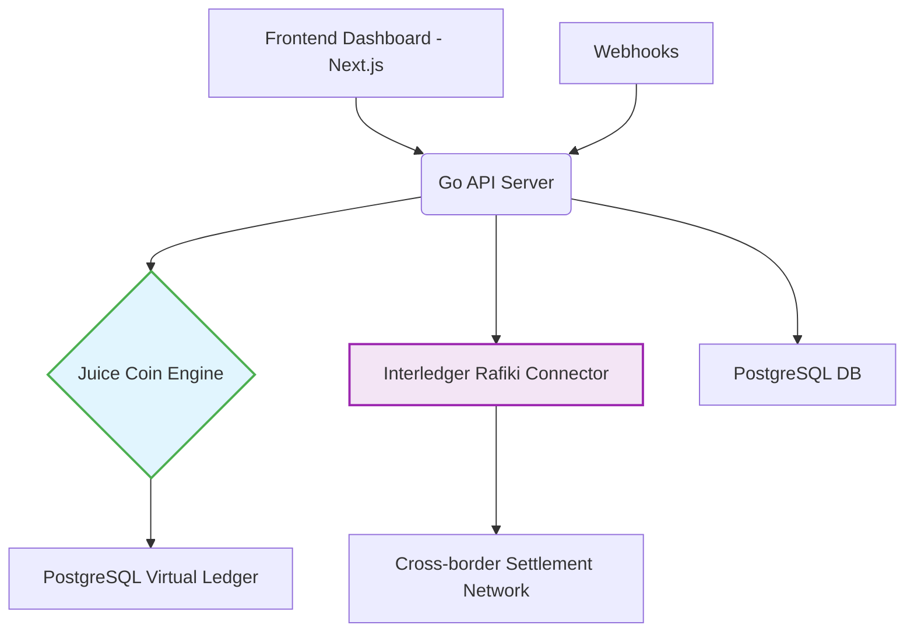

# PesaFlow Sandbox: 🧃 Juice Coin Payment Gateway

> **Experience the future of African cross-border payments with virtual Juice Coins (JUC). Real technology, zero risk.**
>
> PesaFlow is a platform designed to solve the challenges of cross-border payments for African businesses. This **sandbox environment** uses the **Interledger Protocol (ILP)** to demonstrate instant, low-cost settlement.

---

## 🌟 Quick Links

| Link | Description |
| :--- | :--- |
| **[View Demo]** | See the Live Sandbox in action (when available) |
| **[API Documentation]** | Explore our developer-first REST API |
| **[Interledger Docs]** | Learn more about the underlying ILP technology |
| **[License]** | MIT License Details |

---

## 🛠️ Badges

 *← Replace with your actual repo link!*

---

## 🎯 The Vision: Solving Africa's Payment Problem

Juice Coin is a **virtual currency demonstration** of PesaFlow. It's built to showcase how modern, open payment technology can specifically address the pain points of **African Small and Medium Enterprises (SMEs)**.

### 🌍 The Challenge
African SMEs lose time and money due to a fragmented financial landscape:

* **High Costs**: Traditional cross-border payments incur **8-15% fees**.
* **Slow Settlement**: Transactions often take **3-5 days** to complete.
* **Lack of Tools**: Developers lack simple, modern APIs to build cross-border features.
* **Fragmentation**: Difficulties in accepting payments across different African countries.

### 💡 Our Solution
The Juice Coin Sandbox provides a risk-free environment to interact with a truly modern payment solution:

* **Virtual Economy**: Transact with **Juice Coins (JUC)** to simulate real-world value transfer.
* **Instant Settlement**: Payments are completed in **minutes, not days**, powered by the Interledger Protocol.
* **Developer First**: Access to a full **REST API** for building and testing integrations.
* **Real Technology**: Utilizes the open-source **Rafiki** implementation of ILP.

---

## 🚀 Sandbox Features

| Category | Feature | Description |
| :--- | :--- | :--- |
| **Virtual Currency** | **10,000 JUC Starting Balance** | Every user account is pre-funded for immediate testing. |
| **Simulation** | **Virtual African Merchants** | Simulate transactions between businesses in Kenya, Nigeria, Ghana, and South Africa. |
| **Core Tech** | **Interledger Protocol** | Real-world Rafiki integration for high-performance, cross-ledger settlements. |
| **Interface** | **Modern React Dashboard** | Intuitive merchant and user interfaces for transaction tracking and analytics. |
| **Safety** | **No Real Money** | JUC is for educational demonstration only and holds **zero monetary value**. |

---

## 🏗️ Technical Architecture

The platform is designed for high-performance and scalability, utilizing best-in-class open-source technologies.

## 🛠️ Tech Stack

### Backend
- **Go 1.21+** - High-performance API server
- **Gin Framework** - HTTP web framework
- **GORM** - Database ORM
- **PostgreSQL** - Primary database
- **Rafiki Money** - Interledger connector

### Frontend
- **Next.js 14** - React framework
- **TypeScript** - Type safety
- **Tailwind CSS** - Styling
- **Chart.js** - Analytics and metrics

### Infrastructure
- **Docker** - Containerization
- **Kubernetes** - Orchestration
- **Prometheus** - Monitoring
- **Grafana** - Dashboards

## 🚀 Quick Start

### Prerequisites
- Go 1.21+
- PostgreSQL 14+
- Node.js 18+
- Docker (optional)
